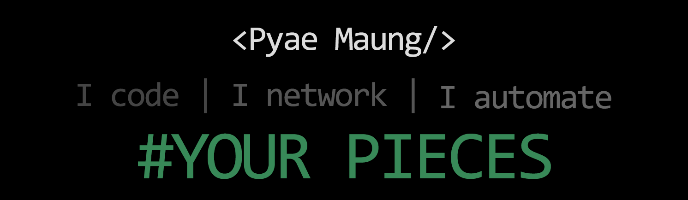

<!--  -->

## 👋 Hello, people!

A motivated computer science graduate from the California State University, East Bay with a cumulative GPA of 3.29. Familiar with various programming languages such as C/C++, Java, Bash/Shell scripting, Python, and networking protocols and models (OSI, TCP/IP), and HTML5 and CSS3 in web development. Have a strong comprehension of OOP and TDD, and a solid ability to pick up new languages quickly.

## 📫 How to reach me: ...

- Social Network : [LinkedIn](https://www.linkedin.com/in/pyaephyomaung/)
- E-mail : pphyo.m@gmail.com
- Resume : [PDF](https://drive.google.com/file/d/1WZHkV0Ka8rrukRIWFTDJUFg8-tiOhTV0/view?usp=share_link) | [DOC](https://docs.google.com/document/d/1S7_UEzdhsEUALWPaseN3EVEXG1RAbrbd/edit?usp=sharing&ouid=101449011204234466505&rtpof=true&sd=true)
    
<!--
**pphyom/pphyom** is a ✨ _special_ ✨ repository because its `README.md` (this file) appears on your GitHub profile.

Here are some ideas to get you started:

- 🔭 I’m currently working on ...
- 🌱 I’m currently learning ...
- 👯 I’m looking to collaborate on ...
- 🤔 I’m looking for help with ...
- 💬 Ask me about ...
- 📫 How to reach me: ...
- 😄 Pronouns: ...
- ⚡ Fun fact: ...
-->
